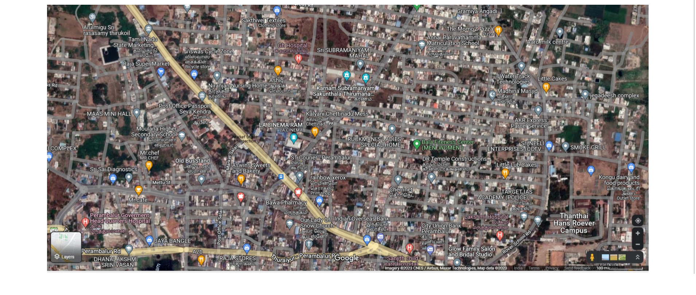
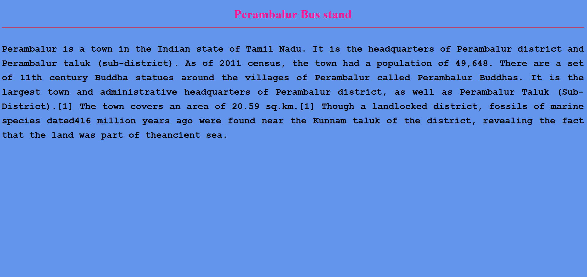

# Places Around Me
## AIM:
To develop a website to display details about the places around my house.

## Design Steps:

## Step 1:
Clone the github respository into Theia IDE

## Step 2:
Create a new django project

## Step 3:
Write the needed HTML code

## Step 4:
Run the django server and execute the HTML files

## Code:
## Map
```html
<!DOCTYPE html>
<html lang="en">
<head>
<title>My City</title>
</head>
<body>
<h1 align="center">
<font color="red"><b>PERAMBALUR</b></font>
</h1>
<h3 align="center">
<font color="blue"><b>RAJA R</b></font>
</h3>
<center>

<map name="image-maps-2023-01-25-044930" id="ImageMapsCom-image-maps-2023-01-25-044930"> </map>
<area shape="rectangle"coords="441,495,542,587" href="/static/html/bus.html"title="BUSTAND">
<area shape="rectangle"coords="608,325,666,375" href="/static/html/temple.html"title="TEMPLE">
<area shape="rectangle"coords="830,597,902,652" href="/static/html/stationary.html"title="STATIONARY SHOP">
<area shape="rectangle"coords="419,267,522,359" href="/static/html/postoffice.html"title="POST OFFICE">
<area shape="rectangle"coords="566,745,662,833" href="/static/html/textile.html"title="TEXTILE SHOP">
</map>
</center>
</body>
</html>
```
## Bus stand
```html
<!doctype html>
<html>
<head>
	<title>Perambalur Bus stand</title>
</head>
<body bgcolor="CornflowerBlue">
<h1 align="center">
	<font color="deeppink">
		<b>Perambalur Bus stand</b>
	</font>
	<hr size="2" color="red">
<p align="justify">
<font face="Courier New" size="5">
<body>
	Perambalur is a town in the Indian state of Tamil Nadu. It is the headquarters of Perambalur district and Perambalur taluk (sub-district).As of 2011 census, the town had a population of 49,648.

There are a set of 11th century Buddha statues around the villages of Perambalur called Perambalur Buddhas.
It is the largest town and administrative headquarters of Perambalur district, as well as Perambalur Taluk (Sub-District).[1]

The town covers an area of 20.59 sq.km.[1] Though a landlocked district, fossils of marine species dated 416 million years ago were found near the Kunnam taluk of the district, revealing the fact that the land was part of the ancient sea.
</body>
</html>
```
## Post Office
```html
<!doctype html>
<html>
<head>
	<title>Post ofiice</title>
</head>
<body bgcolor="silver">
<h1 align="center">
	<font color="maroon">
		<b>Post office</b>
	</font>
	<hr size="2" color="red">
<p align="justify">
<font face="Courier New" size="5">
<body>
	A post office is a public facility and a retailer that provides mail services, such as accepting letters and parcels, providing post office boxes, and selling postage stamps, packaging, and stationery. Post offices may offer additional services, which vary by country. These include providing and accepting government forms (such as passport applications), and processing government services and fees (such as road tax, postal savings, or bank fees).[1] The chief administrator of a post office is called a postmaster.
</body>
</html>
```
## Textile
```html
<!doctype html>
<html>
<head>
	<title>Textile shop</title>
</head>
<body bgcolor="lightpink">
<h1 align="center">
	<font color="MidnightBlue">
		<b>Textile Shop</b>
	</font>
	<hr size="3" color="blue">
<p align="justify">
<font face="Courier New" size="5">
<body>
	It is not known when the first clothes shops were opened in Europe. Before the era of ready-made clothes, when clothing was made by tailors or artisans, shops may have sold second-hand clothing. Some ready-made clothes may have been made in the sixteenth century.The number of clothes shops appears to have risen steadily long before the beginning of large-scale industrial manufacture of clothing in the second half of the nineteenth century.
</body>
</html>
```
## Temple
```html
<!doctype html>
<html>
<head>
	<title>Temple</title>
</head>
<body bgcolor="Orchid">
<h1 align="center">
	<font color="maroon">
		<b>Madhurakaliamman Temple</b>
	</font>
	<hr size="2" color="red">
<p align="justify">
<font face="Courier New" size="5">
<body>
	The Mathura Kaliamman Temple is a Hindu temple dedicated to the goddess Kali located in the village of Siruvachur in the Perambalur taluk of Perambalur District, India. Siruvachur is located at a distance of 5 km from Perambalur, its nearest town. The Car festival and the annual Panguni festivals are important festivals celebrated.Kannagi came across this Devi temple at Siruvachur and decided to rest there for the night. During her stay, Chelliamman revealed her servitude, and Kannagi did away with the Tantric and saved Chelliamman.[2] Kannagi now received the name as Mathura Kaliamman, as she is from Madurai & got rid of the tantric with the blessings of Kali. 
</body>
</html>
```
## Stationary
```html
<!doctype html>
<html>
<head>
	<title>Stationary</title>
</head>
<body bgcolor="PeachPuff">
<h1 align="center">
	<font color="tomato">
	<b>Stationary</b>
	</font>
	<hr size="2" color="red">
<p align="justify">
<font face="Courier New" size="5">
<body>
	Originally, the term 'stationery' referred to all products sold by a stationer, whose name indicated that his book shop was on a fixed spot. This was usually somewhere near a university, and permanent, while medieval trading was mainly carried on by itinerant peddlers (including chapmen, who sold books) and others (such as farmers and craftsmen) at markets and fairs.It was a unique term used between the 13th and 15th centuries in the manuscript culture. Stationers' shops were places where books were bound, copied, and published. These shops often loaned books to nearby university students for a fee.
</body>
</html>
```
## Output:

.png)
.png)
.png)
.png)



## Result:
The Program for implementing image map is executed successfully.